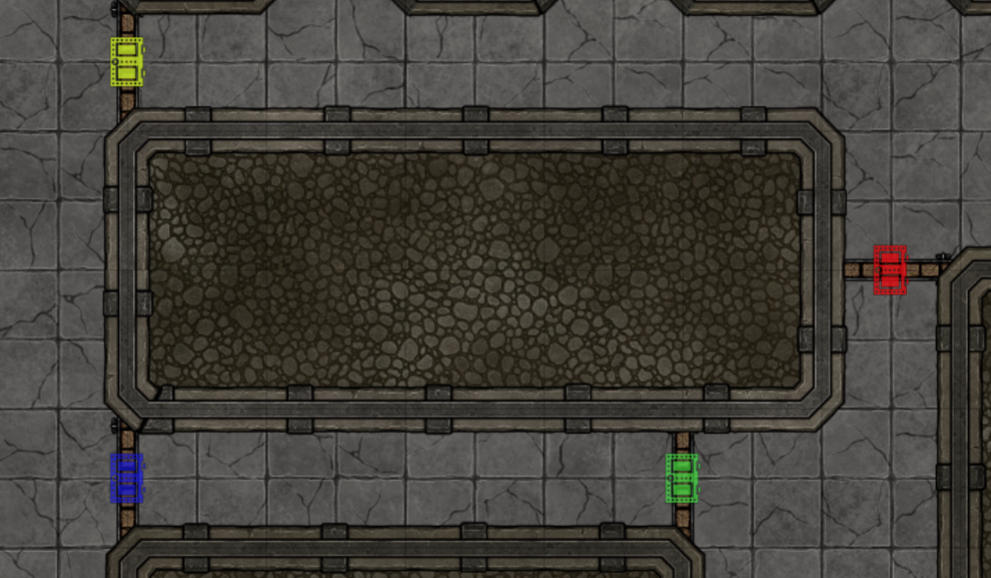

# Smart Doors

 

[](https://forge-vtt.com/bazaar#package=go-to-or-pull-player) 


[](https://www.foundryvtt-hub.com/package/go-to-or-pull-player/)


[](https://weblate.foundryvtt-hub.com/engage/go-to-or-pull-player/)

### If you want to buy me a coffee [](https://www.patreon.com/p4535992)

or support the original author [manuelVo]((https://github.com/manuelVo/)W

[](https://ko-fi.com/staebchenfisch)

Makes doors smarter. Allows doors to synchronize across multiple scenes and sends chat messages when players try to open locked doors (and also tells you which of the doors).

## Installation

It's always easiest to install modules from the in game add-on browser.

To install this module manually:
1.  Inside the Foundry "Configuration and Setup" screen, click "Add-on Modules"
2.  Click "Install Module"
3.  In the "Manifest URL" field, paste the following url:
`https://raw.githubusercontent.com/p4535992/foundryvtt-smart-doors/master/src/module.json`
4.  Click 'Install' and wait for installation to complete
5.  Don't forget to enable the module in game using the "Manage Module" button

### libWrapper

This module uses the [libWrapper](https://github.com/ruipin/fvtt-lib-wrapper) library for wrapping core methods. It is a hard dependency and it is recommended for the best experience and compatibility with other modules.

### socketLib

This module uses the [socketLib](https://github.com/manuelVo/foundryvtt-socketlib) library like a dependency. It is a hard dependency and it is recommended for the best experience and compatibility with other modules.

## Known Issue\Limitation

## API (on developing)

## Features

### Consistent Door Control Size


Door Control icons will be rendered the same size in every scene, regardless of the configured grid size. The size of the icons is configurable.

### Toggle Secret Doors


Easily reveal secret doors to players. Alt+left click secrets doors to turn them into regular doors. Alt+left click can also be done on normal doors to turn them into secret doors. The keybinding for this feature can be reconfigured.


### Locked Door Alerts


Keep everyone informed who tried to open which door. Whenever a player tries to open a door that is locked, a chat message stating that fact will be sent to all players. Additionally the door locked sound will be played for everyone. When the chat message is hovered with the mouse, the door that the player tried to open will be highlighted.

If the GM tries to open a locked door the sound will only played for him and no chat message will be sent.

### Tint Secret Doors
This tints secret doors in a gray shade to make them easier to discern from regular doors when being zoomed further out.

### Tint Doors

Allows GM users to change the color of door icons through the wall configuration window.



### Synchronized Doors


Keep multiple doors in sync - even across different scenes. Example use cases:
- A tavern has an outdoor and an indoor scene. If a player opens the entrance door on the outdoor map, the entrance door in the indoor map will be opened as well
- An ancient trap that opens the cell of a monster once the door to the treasury is opened.

#### Usage
To set up door synchronization, assign all doors that should be synchronized to the same Synchronization Group. The Synchronization Group can be any text. Doors that have the same Synchronization Group set will be synchronized. This will work across different scenes. At least two doors must be assigned to the same Synchronization Group. If only a single door is assigned to a synchronization group it will behave as any other normal door.

Once a Synchronization Group is set up for multiple doors, simply open/close/lock/unlock one of the doors to achieve the same effect on other doors as well.

## Features ideas
- Attach macros to doors that are being executed when the door is being opened/closed
- Give out keys to players, that allow them to lock/unlock associated doors
- Doors that can only be seen from one side when closed
- Only allow doors to be opened of the character is near
- Doors that can only be opened from one side

# Build

## Install all packages

```bash
npm install
```
## npm build scripts

### build

will build the code and copy all necessary assets into the dist folder and make a symlink to install the result into your foundry data; create a
`foundryconfig.json` file with your Foundry Data path.

```json
{
  "dataPath": "~/.local/share/FoundryVTT/"
}
```

`build` will build and set up a symlink between `dist` and your `dataPath`.

```bash
npm run-script build
```

### NOTE:

You don't need to build the `foundryconfig.json` file you can just copy the content of the `dist` folder on the module folder under `modules` of Foundry

### build:watch

`build:watch` will build and watch for changes, rebuilding automatically.

```bash
npm run-script build:watch
```

### clean

`clean` will remove all contents in the dist folder (but keeps the link from build:install).

```bash
npm run-script clean
```
### lint and lintfix

`lint` launch the eslint process based on the configuration [here](./.eslintrc)

```bash
npm run-script lint
```

`lintfix` launch the eslint process with the fix argument

```bash
npm run-script lintfix
```

### prettier-format

`prettier-format` launch the prettier plugin based on the configuration [here](./.prettierrc)

```bash
npm run-script prettier-format
```

### package

`package` generates a zip file containing the contents of the dist folder generated previously with the `build` command. Useful for those who want to manually load the module or want to create their own release

```bash
npm run-script package
```

## [Changelog](./changelog.md)

## Issues

Any issues, bugs, or feature requests are always welcome to be reported directly to the [Issue Tracker](https://github.com/manuelVo/foundryvtt-smart-doors/issues ), or using the [Bug Reporter Module](https://foundryvtt.com/packages/bug-reporter/).

## License

- [Door Colors](https://github.com/jessev14/door-colors) ([MIT](https://github.com/jessev14/door-colors/blob/main/LICENSE))

This package is under the [Foundry Virtual Tabletop Limited License Agreement for module development](https://foundryvtt.com/article/license/).

## Acknowledgements

Bootstrapped with League of Extraordinary FoundryVTT Developers  [foundry-vtt-types](https://github.com/League-of-Foundry-Developers/foundry-vtt-types).

## Credit

Thanks to anyone who helps me with this code! I appreciate the user community's feedback on this project!

- Thank you to [jessev14](https://github.com/jessev14/) for the module [Door Colors](https://github.com/jessev14/door-colors)
